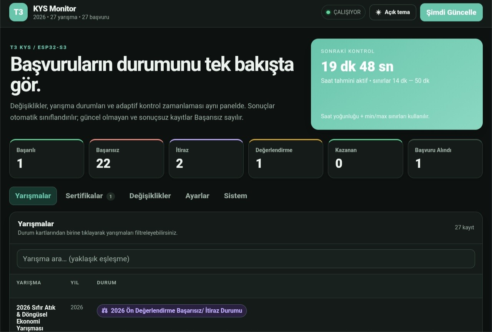
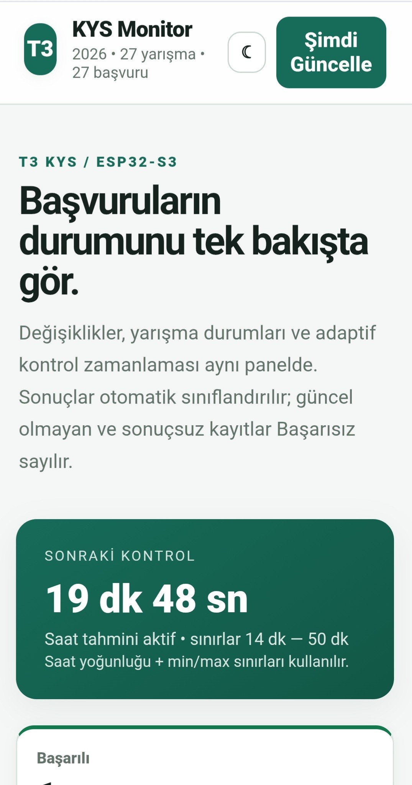
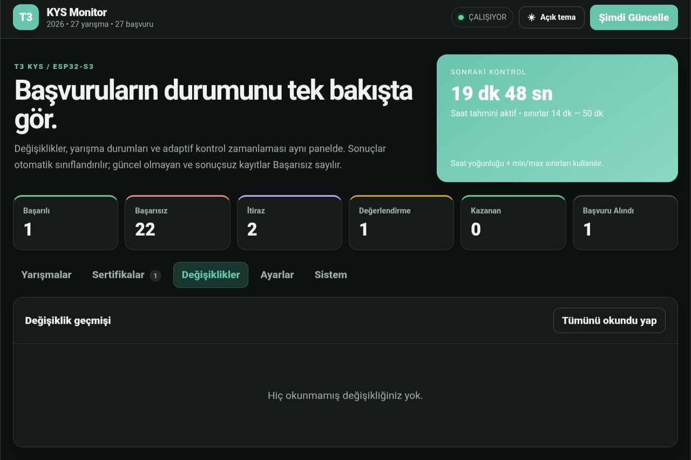

# KYS Monitor

ESP32-S3 ve MicroPython üzerinde çalışan, T3 KYS başvurularını periyodik olarak kontrol eden ve sonuçları yerel bir web arayüzünde gösteren hafif bir izleme uygulaması.

> **Not:** Bu proje T3 KYS veya TEKNOFEST tarafından yayımlanmış resmî bir yazılım değildir. T3 KYS'nin web arayüzü ve API davranışlarında yapılabilecek değişiklikler uygulamanın çalışmasını etkileyebilir.

## Özellikler

- T3 KYS hesabıyla HTTPS üzerinden oturum açma
- Başvuru verilerinin periyodik olarak alınması
- Başvuru durumlarının sınıflandırılması ve önbelleğe alınması
- Değişiklik geçmişi ve okunmamış değişiklik takibi
- Dahili RGB LED ile çalışma durumu göstergesi
- Adaptif kontrol aralığı
- ESP32 üzerinde çalışan bağımlılığı düşük HTTP dashboard
- Yarışma ayrıntıları ve sertifika görünümü
- Dashboard üzerinden Wi-Fi, hesap ve kontrol ayarlarını değiştirme
- Verilerin cihazın yerel Flash dosya sisteminde tutulması

## Donanım ve yazılım

**Hedef donanım:** ESP32-S3 DevKit v1.3  
**Geliştirme ortamı:** MicroPython  
**Kullanılan firmware:** Proje geliştirilirken ESP32-S3 SPIRAM build'i kullanılmıştır.

Bu sürümde dahili RGB LED GPIO48 üzerinden sürülür. LED için standart NeoPixel yerine SPI tabanlı WS2812 kodlaması kullanılmıştır.

## Kurulum

### 1. Flash belleğini temizle

ESP32-S3'ü USB ile bilgisayara bağla ve seri portunu kendi sistemine göre değiştirerek şu komutu çalıştır:

```bash
esptool.py --chip esp32s3 --port /dev/ttyACM0 erase_flash
```

### 2. MicroPython'u yükle

Ardından MicroPython firmware'ini karta yaz:

```bash
esptool.py --chip esp32s3 --port /dev/ttyACM0 --baud 460800 write_flash -z 0x0 ESP32_GENERIC_S3-SPIRAM_OCT-20260818-v1.29.0-preview.731.g1c3c201149.bin
```

Firmware dosyasının adını ve seri portu kendi kurulumuna göre değiştir.

### 3. Wi-Fi bilgilerini ayarla

`main.py` dosyasını karta yüklemeden önce dosyanın başındaki Wi-Fi ayarlarını kendi ağına göre doldur:

```python
WIFI_PROFILES = [
    {"ssid": "WiFi_Adin", "password": "WiFi_Parolan"}
]
```

Gerçek Wi-Fi parolanı herkese açık GitHub deposuna gönderme.

### 4. Dosyaları karta yükle

ESP32-S3'e şu iki dosyayı **aynı dosya adlarıyla** yükle:

```text
main.py
index.html
```

Dosyaları yükledikten sonra kartı yeniden başlat.

### 5. Dashboard'u aç

Kart Wi-Fi ağına bağlandıktan sonra cihazın yerel IP adresini tarayıcıda aç:

```text
http://CIHAZ_IP_ADRESI/
```

İlk açılışta yarışma ayrıntıları alınacağı için başlangıç taraması normalden uzun sürebilir.

### 6. T3 KYS bilgilerini gir

Dashboard açıldıktan sonra ayarlar bölümünden T3 KYS kullanıcı adı/e-posta ve parolanı girip kaydet.

T3 KYS parolanı GitHub'a, ekran görüntülerine veya hata kayıtlarına ekleme.

> Ayrıntılı kurulum için [`docs/INSTALL.md`](docs/INSTALL.md) dosyasına bakabilirsin.

## Yapılandırma

Kaynak kodunda başlangıç değerleri bulunur. Çalışan cihazda ayarlar dashboard üzerinden de değiştirilebilir.

Başlıca ayarlar:

- Wi-Fi profilleri
- T3 KYS kullanıcı adı/e-posta
- T3 KYS parolası
- Normal kontrol aralığı
- Minimum kontrol aralığı
- Maksimum kontrol aralığı

Cihaz üzerinde oluşturulabilecek veri dosyaları:

```text
t3_settings.json
t3_state.json
t3_changes.json
t3_system.json
t3_competitions.json
t3_applications.json
t3_competition_details.json
t3_certificates.json
```

Bu dosyalar kullanıcıya ve cihaza özgü bilgiler içerebilir. Git deposuna dahil edilmemelidir.

## Dashboard

Dashboard; yarışmaları, değişiklikleri, sertifikaları, sistem durumunu ve cihaz ayarlarını tek arayüzde sunar.

Arayüz doğrudan ESP32 üzerinde servis edilir; ayrı bir Flask, Selenium veya Chromium sunucusu gerektirmez.

### Ekran görüntüleri

#### Koyu tema — Yarışmalar



#### Açık tema — Mobil görünüm



#### Koyu tema — Değişiklikler



## Durum LED'i

| Durum | LED |
| --- | --- |
| Hata | Kırmızı |
| Giriş | Sarı |
| Kontrol | Mavi |
| Okunmamış değişiklik | Yeşil |
| Boşta | Kapalı |

Okunmamış değişiklik göstergesi diğer durumların üzerinde önceliğe sahiptir.

## Donanım uyarısı

Dahili RGB LED sürücüsü geliştirme sırasında kart üzerinde özel olarak doğrulanmıştır. Buna rağmen farklı kart revizyonları, LED bileşenleri, zamanlamalar veya elektriksel koşullar farklı sonuç verebilir.

**RGB LED bölümünün yanlış veya uyumsuz kullanımı donanıma zarar verebilir.** LED'in çalışması kritik değilse LED işlevini kullanmamak daha güvenli olabilir.

## Flash kullanımı

Uygulama ayarları, durum bilgileri, başvurular ve değişiklik geçmişi gibi verileri Flash dosya sistemindeki JSON dosyalarında saklar.

Yazma sayısını azaltmak için kodda değişiklik kontrolü ve koşullu kayıt mekanizmaları kullanılmıştır. Buna rağmen çalışma sırasında Flash okuma/yazmaları gerçekleşir. Flash belleğin yazma ömrü sınırlıdır ve yoğun kullanım zaman içinde veri kaybına, dosya sistemi bozulmasına veya depolama arızasına yol açabilir.

**Uzun süreli kullanımda Flash aşınması riski kullanıcıya aittir. Önemli verileri yedekleyin.**

## Güvenlik

Dashboard yerel ağ üzerinde HTTP port 80'de çalışır ve uygulama katmanında ayrı bir dashboard kullanıcı doğrulaması bulunmaz. Bu nedenle:

- Cihazı yalnızca güvendiğiniz ağlarda kullanın.
- Port 80'i internete açmayın.
- Gerçek T3 KYS ve Wi-Fi bilgilerini GitHub'a yüklemeyin.
- Cihazın Flash içeriğine fiziksel/yazılımsal erişimi olan kişilerin kayıtlı bilgileri okuyabileceğini varsayın.

Ayrıntılı güvenlik bilgileri [`SECURITY.md`](SECURITY.md) dosyasındadır.

## Proje yapısı

```text
.
├── main.py
├── index.html
├── README.md
├── LICENSE
├── SECURITY.md
├── CONTRIBUTING.md
├── CODE_OF_CONDUCT.md
├── CHANGELOG.md
├── DISCLAIMER.md
├── .gitignore
├── .gitattributes
├── .github/
│   ├── ISSUE_TEMPLATE/
│   │   ├── bug_report.md
│   │   └── feature_request.md
│   └── pull_request_template.md
└── docs/
    ├── INSTALL.md
    ├── CODE_REVIEW.md
    └── screenshots/
        ├── dashboard-dark.jpg
        ├── dashboard-light-mobile.jpg
        └── changes-dark.jpg
```

## Sınırlamalar

- T3 KYS tarafındaki API, giriş sistemi veya WAF değişiklikleri uyumluluğu bozabilir.
- Uygulama internet bağlantısı, DNS, TLS ve uzak sunucu yanıtlarına bağlıdır.
- ESP32-S3'ün RAM ve Flash kaynakları sınırlıdır.
- Dashboard kimlik doğrulaması uygulama tarafından ayrıca yapılmadığından güvenilir LAN varsayımı vardır.
- Donanım ve Flash kullanımıyla ilgili riskler kullanıcı tarafından değerlendirilmelidir.

## Katkıda bulunma

Hata bildirimleri ve geliştirme önerileri için GitHub Issues kullanılabilir. Kod değişiklikleri için [`CONTRIBUTING.md`](CONTRIBUTING.md) içindeki kurallara uyulması beklenir.

## Lisans

Bu proje **MIT License** ile lisanslanmıştır. Ayrıntılar için [`LICENSE`](LICENSE) dosyasına bakın.

## Kaldırma talebi

Bu proje bağımsız olarak geliştirilmiştir. T3 Vakfı tarafından yazılımın veya deponun kaldırılması talep edilirse geliştirici olarak ilgili dosyaları veya depoyu kaldırırım.

## Sorumluluk

Yazılım garanti verilmeden, mevcut hâliyle sunulmaktadır. Donanım hasarı, Flash aşınması, veri kaybı, hesap sorunları, ağ sorunları veya hizmet kesintilerinden proje sahibi sorumlu değildir. Yazılımın kullanımı kullanıcının kendi sorumluluğundadır.
